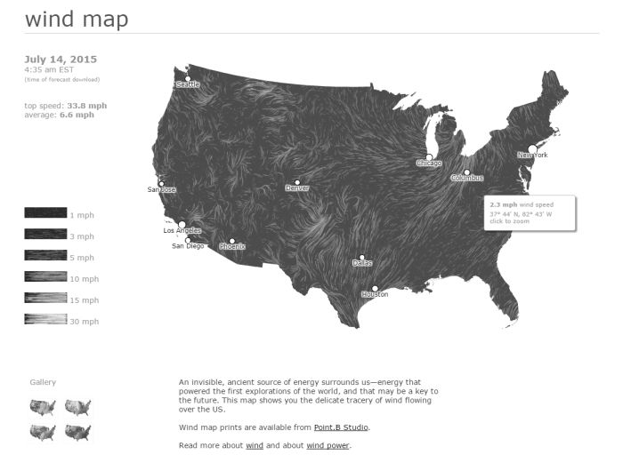
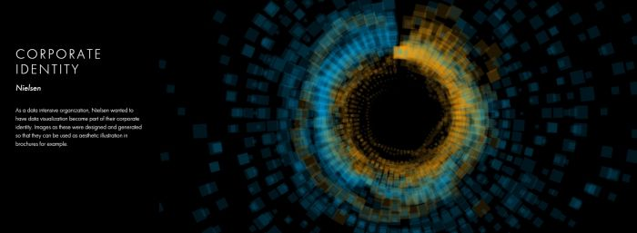

#Where is data visualization going?
by [Clement Levallois](http://www.clementlevallois.net), [DataStorm 2nd edition](http://www.ds3.inesc-id.pt/), Lisbon, July 15, 2015.  

The nice thing about fields in computational science is that they evolve so quickly. Every 6 months or so, there is a new kid on the block in machine learning, mobile app development or text mining.  
This makes it hard to stay at the forefront of these fields, and sometimes we might even loose perspective as to the meaning and goals of what was the field we formed an interest in, just a couple of years back.  

So I take the opportunity of this talk to reflect on data visualization, which is such a young field. I'd like to explore how data visualization has evolved, why there was a need for it to emerge, where it stands today, and I will try to imagine where it will evolve in the coming years.  
Some warnings. I am more an observer than a participat in this field. My view is the one of somebody who came to data visualization around 2009 through network visualizations with Gephi, getting my information mostly from the discussions, links and podcasts shared by data visualizers which I follow and interact with on Twitter. These are personal views and I'd be happy to see them (productively) challenged.  

So I feel that in the last 6 years, dataviz has evolved in significant ways: it emerged and cristalized into a distinct topic, lived happily through a golden age, and we are today somewhere else. Let's start with the beginning.  

##Before dataviz
Before dataviz, there was a couple of established fields of practice dealing with graphics and data. I'll mention 4 of them though there are surely important others:
infoviz, infographics, Business intelligence, and GIS.  

###1. Infoviz
Infoviz is "information visualisation" and is the name of an academic field concerned with  

> "the study of (interactive) visual representations of abstract data to reinforce human cognition." ([Wikipedia entry](https://en.wikipedia.org/wiki/Information_visualization)).  

The strength of this field is that it is a test bench for many assumptions you'd have on how visualizations can be effective, in terms of "reinforcing human cognition". How do colors work? What about different scales? What is the performance of users at solving given problems when reading graph represented as a matrix, versus graphs represented as networks? Should longitudinal data be presented as time slices or animated movies for best understanding? Research in information visualization is concerned with providing solid, empirical answers to these important questions.  

  

The issue is, this emphasis on hypothesis testing can be detrimental to the advancing on the bigger picture: creating visualizations that are widely adopted and used in a world so full of information (or call it noise) that attention by individuals is becoming the scarcest of resources.  
As illustrated by the figure above, and I were to be a bit tough on infoviz, I'd say you need a PhD to get it: the interfaces they design are not engaging enough, not using the platforms that viewers are now using, and the information displayed hardly enhances human cognition for laymen like me.  

###2. Infographics  
You could say that infographics is a bit the contrary of infovis: communication agencies doing pretty much what they want to catch the attention of their readers, at the expense of truthfulness and reliability of the data they invoke. The example below shows how colorful and catchy an infographics can be, and yet completely ineffective at conveying information.  

  
Of course there are excellent infographics and Alberto Cairo, a professor and journalist by trade, reminds us in his book [The Functional Art](http://www.thefunctionalart.com/) that carefully executed infographics are an excellent way to convey complex information in a limited amount of space. But my understanding is that it is not in the basic contract of infographics to have a one to one relation with data, there is a license to *illustrate* the data. The reader must trust the source of the infographics much more than in information visualisation: depending on whether this is an established newspaper with a good graphics team or a communication agency doing quick and dirty work, infographics can be trusted or badly misleading.  

###3. Business intelligence is still another crowd:  

  
The mission is basically to do "excel-level" visualizations in terms of reporting and monitoring business data. Nothing fancy usually there: bar charts, pie charts (often in 3D as in the illustration above, which is wrong), line charts and progress bars assembled in dashboards, sold by companies more versed in the business side of things than graphical design.  

###4. And GIS.  

  
Geographical Information Systems may have a claim for the longest tradition in visualizing data. Tthis is after all their business to draw maps, which is geolocalized data. It could be that this long tradition was also a curse: because they developped these widely desktop software that were widely used in the 1990s, the 2000s and still today, they were entrenched in technologies that could not be easily adapted when web technologies opened up richer, more engaging ways to draw maps and to project overlays of data on them.  

So the scene is the following: scientists in their corner being the guardians of the temple of "proper visualisations", but they have a hard time finding an audience for these graphics. Infographics in the opposite corner, who have access to crowds of readers everyday in the pages of newspapers and marketing brochures, but with a sense that they don't really show the data - they editorialize it a lot, for good or bad. And at the two other corners, we have business intelligence which is a bit scorned upon because of the simplicity of their graphics which does not do justice to the richness of the data, but envied because they have access to relevant, pricey, impactful data. And GIS which works with data in a way which is universally understood and judged relevant (maps), but with a degree of innovation of this field which remains quite low.  

## The emergence of dataviz
Something happened around 2008 and 2009, so around 6 years ago, which changed this statu quo:  
A number of javascript charting and drawing libraries were released: [RaphaelJS](http://raphaeljs.com/) (08/08/08), the [Javascript Infovis Toolkit](http://philogb.github.io/jit/) (2009), [Protovis](http://mbostock.github.io/protovis/) (2009), [Processing.js](http://processingjs.org/) (2010), and [D3](http://d3js.org/) (2011). Together with the take off of mobiles phones without the Flash and Java plugins, the decreasing popularity of the Java plugin even on desktop browsers, you see in 3 years a large technological shift: unification of visualization frameworks on the web using javascript. The web becomes increasingly a platform in itself (more popular than releasing desktop software), with the release of Google Chrome in 2008 - Javascript and CSS become much less broken than when Internet Explorer was dominant. For what impact?  

It shuffled the cards: with Java came a very rigid way to conceive interfaces: windows, menus and even the fonts had a Java look and feel in the browser. In Flash, you had a strong history of interaction and design skills, but you could use Flash without coding, so that designs made with Flash could remain pretty much disconnected from the datasets they represented. All that became thrown into the melting pot of Javascript where everybody had to unlearn their framework and learn on a virgin land.  

Data visualization was not the natural offspring of one of the 4 fields I mentioned, it emerged outside of them. It caused many newcomers to try their hands at these new tools, free from the habits and conventions of the 4 fields we have seen. These newcomers who created dataviz had a different way to look at things, a different tooling, and different ways to function as a group.  This community is remarkable in several aspects:  
    
###1. Individuals possessing an unusually broad mix of skills:
Coding skills for the preparation of the data (Python or R for example), skills in javascript and other scripting language for visual design (ActionScript, Processing), a knowledge of the rules of design and a feel for esthetics, and creativity.  
That is what you need to create this:  

  
(live url: http://www.mta.me)    
(by Alexander Chen, a Creative Director at Google Creative Lab)  

###2. Twitter based communication around the "dataviz" hashtag
In this community, people evaluate each other's works, shared their latest realization chat about past and upcoming conferences but more importantly exhchange info about new frameworks and resources.  

  
(live url: http://neoformix.com/2012/DataVisFieldSubGroups.html)    

###3. A tight knit group across the US and Europe.
I identify (this is an non exclusive list of course) Santiago Ortiz, Jerome Cukier, Jer Thorp, Gregor Aisch, Jan Willem Tulp, Lynn Cherny, Nathan Yau from Flowing Data, Kim Rees from Periscopic, Moritz Stefaner, with a couple of established academics like Enrico Bertini, Jon Schwabish, Alberto Cairo, and in relation with teams at the Guardian and the NYT, and Andy Kirk at VisualisingData as an evangelist and instructor. They were particularly active in spreading news about dataviz and sharing their critical insights which contributed shaping boundaries for the field. This is a personal and of course biaised observation, a systematic investigation reveals a different picture (see above, and below, which is a zoom on the group where I think we would find most people self identifying as dataviz specialists):      

  
(live url: http://neoformix.com/2012/DataVisField1000_Group2.pdf)    

###4. A couple of emblematic projects
- OECD Better Life Index by Moritz Stefaner et al: not infovis, not infographics, just dataviz: simplicity, interaction, access to the data.   

  
(live url: http://www.oecdbetterlifeindex.org/)    

- the "Ghost Counties" visualization by Jan Willem Tulp, 2011: shows creativity and engagement.  

  
(live url, needs Internet Explorer and Flash: http://www.janwillemtulp.com/eyeo/)    

- U.S. Gun Deaths by Periscopic, http://guns.periscopic.com/?year=2013  

  
(live url: http://guns.periscopic.com/?year=2013)  

The emergence of data visualisation as a set of practice and professionals was coinciding with the surge in the new importance of data as a driver of value for business. "Data visualization" became positioned as one powerful lever to extract value from datasets: it possesses both the rigor needed to report objectively on key data features, that you'd find otherwise in information visualisation, and the power to be engaging with the domain specialists or the managers in charge of finding insights in the data.

###5. Two aspects where data visualization epitomizes its value: maps and networks.  
Visualization of geolocalized data and of network data has of course a long history before the birth of data visualization: many software integrated mapping functions from Geographical Information Systems, and network analysis packages also add visualization add-ons.  

What data visualization brought was impactful visualizations making engagement with data just stronger, more powerful. Stamen, an agency with strong ties in the data visualization community, does this kind of maps:  

  
(live url: http://prettymaps.stamen.com/201008/#10.00/38.7250/-9.1500)  
Not your usual GIS mapping! What this kind of map brings is: interaction, accessibility, and most of all enhanced **engagement** with the viewers.

In terms of networks, a pre-dataviz typical network would look like:  

  

Dataviz brought interaction, web-based interactions:

  
(live url: http://bl.ocks.org/mbostock/1062288)  

This type of visualization means you can explore the viz, not just stare at it. You can share it - just paste the url. It can be developed and modified by a large pool of developers because it is written in javascript, which is  the common language of web development. There is a strong sense of esthetics and natural feeling using it. It will encourage curiosity, exploration, and just increase 10 folds the time spent on it by the viewers.  

A short note on Gephi here: Gephi is a desktop software developed in Java. This contributes to explain why it takes years to release the next version of Gephi, as compared to development cycles that are measured in months for javascript dataviz frameworks. I hope Gephi will overcome this weakness.  

###6. If we were looking for 2 defining traits of dataviz:

####a) Data is for the viewer to see and play with  
There is the assumption that the visualization should not provide you with flat and unverifiable conclusions: it should show the data in a transparent, verifiable form. Of course there is a narrative and an editorialization of how the datais presented, **but** it always remains possible for the viewer to challenge this editorial view because the data is here for anyone to explore and interact with.
This represents a fundamental break with infographics, which can hide the underlying data by design, or show it with strong bias by carelessness and still be "OK" by pre-dataviz standards. It is also a break with infovis, were data is indeed there but you might not be enticed to engage with it.  

####b) Custom made, creative act  
Because we are in the browser there is no click and point solutions for the visualization of the data. This departs strongly from GIS where "custom" maps could be done by selecting options in a menu, and also a big change from dashboards in business intelligence where you could drag and drop charts to build a visualization. The sense of esthetics and the particularity of the datasets makes of each dataviz a craftwork.  
One of the best examples is this one by Hint.fm: 

  
(live url: http://hint.fm/wind/)  
(live url for a worldwide version: http://earth.nullschool.net/)  

##2014-2015: The stabilization of #dataviz
Anyhow, industrialization in dataviz came in rapidly, with Tableau becoming the leader for general purpose viz, dashboards reinvented themselves in dataviz-style with Bime, Qlik, Palantir to name a few.  

  

Dataviz became integrated into the business discourse on big data: the Harvard Business Reviews features in 2012 a blog section on data visualization where Jer Thorp contributed to set perspectives straight on data,  

  
(live url: https://hbr.org/2012/11/data-humans-and-the-new-oil/)  

Nielsen, the leader of market data and market research, worked on its corporate identity to include data visualization, with data-driven visuals custom made by Jan Willem Tulp:

  

Since 2012 or so, General Electric partners with Fathom, the agency created by Ben Fry (creator of Processing!) to build visualizations relative to their corporate identity, with some impressive realizations:

  
(live url: http://visualization.geblogs.com/visualization/powering/)  

And in 2015, you know dataviz has fully stabilized when you see a panel on dataviz with Chelsea Clinton:

  
(live url: https://www.youtube.com/watch?v=YFrmQDCpgxs - the panel is with Ben Fry).  

So until 2012 and 2013 I'd say that we were in the golden age of #dataviz in terms of discoveries and charting new paths: excited comments on new productions by the NYT, debates around the goals of #dataviz: is it a way to tell stories? To open new worlds? To educate? New connections made with new comers, new agencies, people meeting for the first time in conferences after exchanging on Twitter for years, new positions, big clients...

And in 2015, things seem to have stabilized and normalized. The energy has changed. The conversation on Twitter has slowed down a lot. The sense of being pionneers has eroded, because time has passed and because we have indeed tried and explored many low hanging fruits. Many individuals are now engaged in more industrial, long term projects. So that's not bad news: dataviz is now mainstream and well established, people are less obliged to enter free competitions and work on long personal projects at weekends and nights to get their name out, that's good. But I miss a bit the excitement of the previous years when you had one framework or one big personal project published per month, and when you had all these big shots chatting on Twitter about the upcoming developments for dataviz.

## 2015 onwards: where is dataviz going?
So... where is dataviz going? As I said, you have this first exciting phase that passed, and we are now in a stage where processes for the creation of dataviz are more industrialized, commodified, stabilized. This means that innovation will find other places to erupt. Why? Because the landscape of technologies keeps changing, and creative minds will seize the opportunity to play and explore these opportunities in places where no "client" is yet waiting for them.  

To illustrate possible paths, I like to give the example of the career of [Seb Lee-Delisle](http://www.seb.ly), who defined himself as a creative coder and now as a digital artist. I follow his work on Twitter since about 2009. He is not at the heart of the "dataviz" network and does not define himself in regards to this label, but you'd find him on Jeff Clark's map of dataviz in 2012 nonetheless (see map above).  

- so, he was using Adobe Flash as one of his main technologies until 2009, contributing to PaperVision3D, a framework to build 3D games and animations in the Flash Player.  
- He plays a bit with Adobe Flex in 2009,  
- in 2010, he moves to HTML5 technologies, using and teachig animated graphics in Javascript  
- in 2012, he does the lunar trail project: http://seb.ly/work/lunar-trails/
- in 2013, he does pixelpyros: http://pixelpyros.org/  
- in in 2014/2015, he launches workshops on "Stuff that talk to the Internets": http://seb.ly/st4i-stuff-that-talks-to-the-interwebs/  

This path, and similar paths followed by others, suggest that:

1. The computer screen and even the screen of the mobile phone is becoming less hegemonic as the medium where data can be visualized. Objects, sculptures, buildings, furniture... this is the next frontier to be explored. Not just mapping data on a flat surface, but maybe even actual construction of data objects (see [1](http://www.nand.io/visualisation/emoto-installation) for a nice example by Moritz Stefaner).   

2. Interaction is richer than we are used to. When we leave the "screen" environment (desktop of mobile), interactions with the user become more diverse. Not just the hand and the click of the mouse, but the whole body. Not one individual facing an object, but possibly a crowd, possibly moving, possibly gesturing. 

3. And "data" is in the process of getting an even larger meaning. I mean, I was happy to move from a tabular notion of data to playin with "unstructured text": like wow, that opens wild possibilities! But when you move away from the screen and start connecting to a variety of objects and sensors, and with a variety of people, data takes still other forms: real time measurements from the external physical environment, from the internal (body) environment, from local or distant social interactions as they unfold, all while staying connected to the APIS we are already faimilar with... the mix can be bring impactful results.  

So, if visualizing data from the Twitter API was the cliché of #dataviz in 2010 - 2015, the next cliché could be the instantaneous 3D printing of data generated from the connected objects and bodies in a home or a workspace.  

**This is just my vision for dataviz, I'd be happy to discuss it with you now!  Thank you!**

